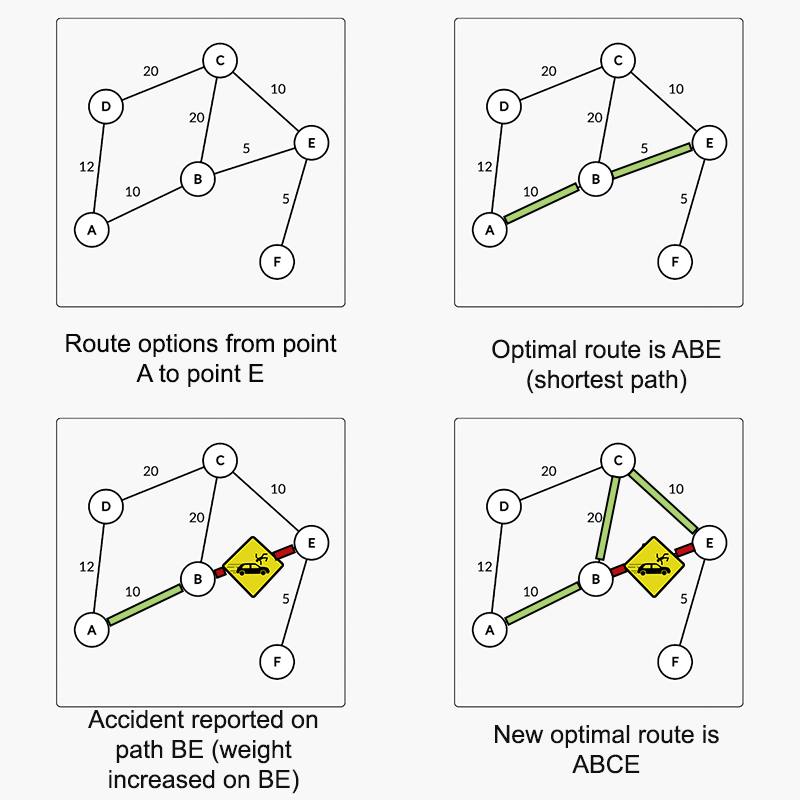

## ONDC Innovation Solution

### Description
A prototype for load & route optimization to determine optimal vehicle load and an optimised route between farmers & consumers (pick up & drop location(s)) to ensure minimum cost of operations by ensuring maximum usage of space in terms of load carrying capacity and/or volumetric packing efficiency and ensuring timely delivery of farm and dairy produce depending on commodity type/ category type, shelf life, price  of produce

### Load Optimization

- Knapsack algorithm is being used for determining what all lots are to selected so that the maximum volumetric efficiency or maximum weight carrying capacity for a truck load is achieved
- giving a higher priority depending on the value of variable ‘X’ where value of ‘X’ for a lot depends upon
  - Shelf Life
  - Commodity Type
  - Total price of lot


### Route Optimization

- Finding the most optimal route between two nodes 
- Scraped sample road data from openMapsApi and stored it in geoJson
- Used the geoJson file to create a map for our service
- Applied Dijkstras on the map to find the shortest path while giving variable weightage to every edge
- In case of a road blocker/diversion/accident reported, incrementing the weight of the edge, thus allowing Dijkstras to choose a shorter path
- Used goRoutines to decrement the weight of the edge after a fixed period of time, such that the existing shortest path starts appearing again.




## Building and Running the service

Service is built in goLang. 

To run the service follow the following steps :

- Clone the repo
- Download all libraries `go mod tidy`
- Run the service `go run cmd/main.go`
- Sample curls for requests are mentioned below

1. Curl for load optimisation
```
curl --location --request POST 'localhost:8080/api/v1/optimise-load' \
--header 'Content-Type: application/json' \
--data-raw '  {
    "request_id": "UUID",
    "type_of_good": 2,
    "vehicle":
    {
      "max_load_capacity": 100,
      "height_in_cm": 100,
      "width_in_cm": 5000,
      "length_in_cm": 1
    },
    "number_of_items": 6,
    "item": [
      {
        "name": "first",
        "weight": 20,
        "box_length_in_cm": 5000,
        "box_width_in_cm": 1,
        "box_height_in_cm": 25,
        "shelf_life_days": 17,
        "cost": 270
      },
            {
        "name": "second",
        "weight": 20,
        "box_length_in_cm": 5000,
        "box_width_in_cm": 1,
        "box_height_in_cm": 25,
        "shelf_life_days": 7,
        "cost": 270
      },
            {
        "name": "third",
        "weight": 20,
        "box_length_in_cm": 5000,
        "box_width_in_cm": 1,
        "box_height_in_cm": 25,
        "shelf_life_days": 2,
        "cost": 270
      },
            {
        "name": "fourth",
        "weight": 20,
        "box_length_in_cm": 5000,
        "box_width_in_cm": 1,
        "box_height_in_cm": 25,
        "shelf_life_days": 7,
        "cost": 270
      },
            {
        "name": "fifth",
        "weight": 20,
        "box_length_in_cm": 5000,
        "box_width_in_cm": 1,
        "box_height_in_cm": 25,
        "shelf_life_days": 2,
        "cost": 270
      },
            {
        "name": "sixth",
        "weight": 20,
        "box_length_in_cm": 5000,
        "box_width_in_cm": 1,
        "box_height_in_cm": 25,
        "shelf_life_days": 1,
        "cost": 270
      }
    ]
  }'
```

2. Sample curl for route optimisation

```
curl --location --request POST 'localhost:8080/api/v1/optimise-route' \
--header 'Content-Type: application/json' \
--data-raw '{
    "request_id": "some_sha_value",
    "start_location": {
        "latitude": 28.660183761958574,
        "longitude": 77.22854375839233
    },
    "end_location": {
        "latitude": 28.65771717702983,
        "longitude": 77.2172999382019
    }
}'
```

3. Sample curl for adding blocker on a road

```
curl --location --request POST 'localhost:8080/api/v1/report-blocker' \
--header 'Content-Type: application/json' \
--data-raw '{
    "blocker_type": "Accident",
    "road_start_coordinate": {
        "longitude": 77.218931,
        "latitude": 28.657039
    },
    "road_end_coordinate": {
        "longitude": 77.21833,
        "latitude": 28.657171
    }
}'
```

4. Sample curl for optimising multi node route

```
curl --location --request POST 'localhost:8080/api/v1/optimise-multinode' \
--header 'Content-Type: application/json' \
--data-raw '{
    "request_id": "some_sha_value",
    "location_list":
    [{
        "latitude": 28.660183761958574,
        "longitude": 77.22854375839233
    },
    {
        "latitude": 28.65771717702983,
        "longitude": 77.2172999382019
    },
    {
        "latitude": 28.645703514027513,
        "longitude": 77.21066951751709
    }
    ]
}'
```

### Team 
- Shivam Paliwal
- Rishabh Singh
- Vaibhav Ahuja